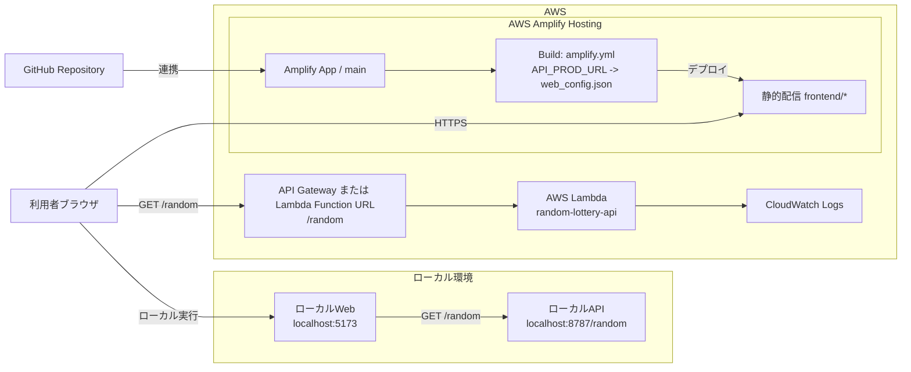

# ランダム抽選アプリ

## 画面の使い方
1. 画面で開始番号・終了番号を入力する。
2. 初期状態はミュートなので、必要に応じて右上のミュート解除と音量バー調整を行う。
3. 「抽選スタート！」を押下して当選番号を表示する。
4. 履歴メモ入力、履歴クリア、JSON保存を必要に応じて使う。

## このアプリの構成
- `frontend/index.html` / `frontend/style.css`: 画面テンプレート/スタイル
- `frontend/src/app.ts`: フロントのエントリポイント
- `frontend/src/app/*.ts`: フロントの機能別モジュール
- `frontend/dist/app.js`: フロントのビルド成果物（配信用）
- `frontend/assets/`: 画像・音声
- `frontend/web_config.example.json`: 画面設定テンプレート（公開可）
- `frontend/web_config.json`: 実運用設定（非公開・git管理外）
- `backend/local/server.ts`: ローカルAPI（`GET /random`）
- `backend/lambda/index.ts`: 本番Lambdaハンドラ
- `backend/shared/random.ts`: 抽選ロジック共通部
- `scripts/*.ts`: 起動/停止/デプロイスクリプト
- `config.json`: AWS・ローカル実行設定（非公開）

## AWS技術構成図（Mermaid）
以下の構成図は Mermaid 記法で記載しています。



補足:
- ローカル確認時（`npm run local-up`）は、`localhost:5173` の画面から `localhost:8787/random` を呼び出します（どちらも `config.json` で変更可能）。
- フロントは Amplify Hosting から配信され、抽選APIは `API_PROD_URL` で指定したエンドポイントへアクセスします。
- `API_PROD_URL` には API Gateway のURL、または Lambda Function URL を設定できます。

## 設定ファイルの役割
### `config.json`（運用者向け / 機密情報あり）
- AWSリージョン、Amplify/Lambda設定、ローカルポート設定
- `scripts/*.ts` が参照

### `frontend/web_config.json`（画面向け / 機密情報なし）
- 画面文言、演出時間、履歴設定
- `frontend/dist/app.js` が読み込む
- 公開ソース（`frontend/web_config.example.json`）にはAPI URLを保持しない
- ローカル実行時は `api.dev` 未設定でも `http(s)://<現在ホスト>:8787/random` へ自動フォールバック
- `config.json` で `local.apiPort` を 8787 以外にする場合は、`frontend/web_config.json` の `api.dev` を明示設定する

## デプロイ

### 初期セットアップ
前提: Node.js（v18 以上、v22 推奨）

```bash
cd random-lottery
npm install
cp config.example.json config.json
cp frontend/web_config.example.json frontend/web_config.json
npm run build:frontend
```

### 本番デプロイ手順
前提条件:
- AWS CLI インストール済み
- AWS 認証設定済み（`aws configure`）
- Amplify と Lambda の権限あり
- `config.json` の `aws` / `hosting` / `lambda` 設定済み

1. Lambda を更新。

```bash
npm run lambda-up
```

2. Amplify の環境変数 `API_PROD_URL` を設定。
- Amplify Console > App settings > Environment variables
- キー: `API_PROD_URL`
- 値: 本番API Gateway / Lambda URL
- ブランチ: `main`（または対象ブランチ）

3. Hosting を更新。

```bash
npm run hosting-up
```

補足:
- `amplify.yml` では `frontend/web_config.example.json` から `frontend/web_config.json` を毎回生成し、`API_PROD_URL` を `api.prod` に注入する
- API URL をリポジトリへ直書きしない運用を前提
- `npm run hosting-up` 実行時、解決した Amplify `appId` を `config.json` の `hosting.appId` へ自動反映する
- `npm run hosting-up` は Amplify 側のビルド/デプロイを開始するだけで、ローカルの `frontend/web_config.json` は更新しない

### リソース削除
- `up` = 作成/更新、`down` = 削除
- ローカル停止は `local-stop`（`local-down` は互換エイリアス）
- Amplify削除は `config.json` の `hosting.downConfirm=DELETE` が必要

```bash
npm run deploy-down
```


### 改修方法
1. 変更する（主に `frontend/src/app.ts` / `frontend/src/app/*.ts` / `backend/**/*.ts`）。
2. ローカル確認を起動する。

```bash
npm run local-up
```

- `local-up` 実行時に `npm run build:frontend` が走り、`frontend/dist/app.js`（1ファイル bundle + minify）と `frontend/dist/app.version.json`（更新時刻ベースのバージョン）が更新される
- `local-up` 実行時に自動でブラウザの画面が開く
- フロント: `http://localhost:<local.webPort>`（既定: `http://localhost:5173`）
- API: `http://localhost:<local.apiPort>/random`（既定: `http://localhost:8787/random`）

3. 停止する。

```bash
npm run local-stop
```

4. まとめて本番更新する場合。

```bash
npm run deploy-up
```

## 設定パラメタ
### `config.json`
- `aws.region`
- `local.apiPort` / `local.webPort`
- `hosting.appId`（`hosting-up` 実行時に自動反映） / `hosting.appName` / `hosting.branch`
- `hosting.repository` / `hosting.oauthToken` / `hosting.platform`
- `hosting.downConfirm`
- `lambda.functionName` / `lambda.executionRoleArn`
- `lambda.runtime` / `lambda.handler` / `lambda.timeout` / `lambda.memorySize`

### `frontend/web_config.json`
- `appName`
- `uiText.*`
- `minDefault` / `maxDefault`
- `api.dev`（任意）/ `api.prod`（本番）
- `animation.spinMs` / `animation.tickMs` / `animation.glowOnResultMs`
- `history.maxItems` / `history.persistToLocalStorage` / `history.storageKey`

補足:
- `api.dev` は任意（未設定時はローカルフォールバックを使用）
- `api.prod` は `amplify.yml` が `API_PROD_URL` から自動注入
- `api.dev` は自動注入されないため、必要な場合は `frontend/web_config.json` へ手動設定する

## 音源
- BGM: `frontend/assets/bgm.mp3`
- ドラムロール: `frontend/assets/drumroll_6sec.mp3`
- 歓声SE: `frontend/assets/cheer_2sec.mp3`
